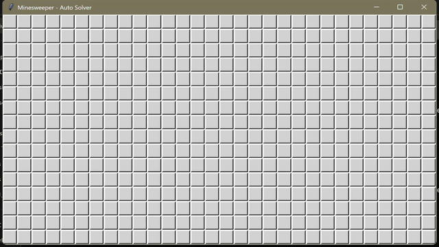

# Minesweeper-Automatic-Solver
Minesweeper automatic solver by iterative scaling with GUI visualization built in Python using Tkinter.



## Features

- Iterative constraint propagation for mine probability estimation
- Strategic solver that prioritises the most certain move
- Real-time probability visualisation on interactive board

## Usage

The script requires Python 3.6+ and tkinter (usually included with Python). 

The solver plays in **automatic mode** by default, where users can provide the `-n/--num-games` parameter to specify the number of games to play before exiting (unlimited by default). The solver can also be run in **assisted mode** with `-a/--assist`, where it displays the mine probability without automatic execution, allowing users to develop their own strategies. 

By default, it initiates an Expert game (16×30 with 99 mines), while the exact settings can be tuned using `-r/--rows` for the number of rows, `-c/--cols` for the number of columns, and `-m/--mines` for the number of mines. 

One can specify a master seed with `-s/--seed` to initialize a series of new games, or specify a specific game seed with `-g/--game-seed` when playing a single game. Game statistics are recorded in `minesweeper_log.csv`.

### Examples

Play 100 games in automatic mode:
```bash
python minesweepersolver.py -n 100
```

Play an intermediate game in assisted mode:
```bash
python minesweepersolver.py -r 16 -c 16 -m 40 -a
```

Play a single game with a specific seed:
```bash
python minesweepersolver.py --game-seed 12345
```

## Results

For 105 automated runs on Expert games, the solver achieved a ~34% win rate. Successful runs accounted for ~60% of the total 22,874 cells expanded across all games. Mean time played for a game is ~6.5s and mean time to win a game is ~10.4 seconds. 

## Reference

Mike Sheppard. A simple Minesweeper algorithm. Authoritative Minesweeper (2023). Accessed on Feb 23, 2025. https://minesweepergame.com/math/a-simple-minesweeper-algorithm-2023.pdf
